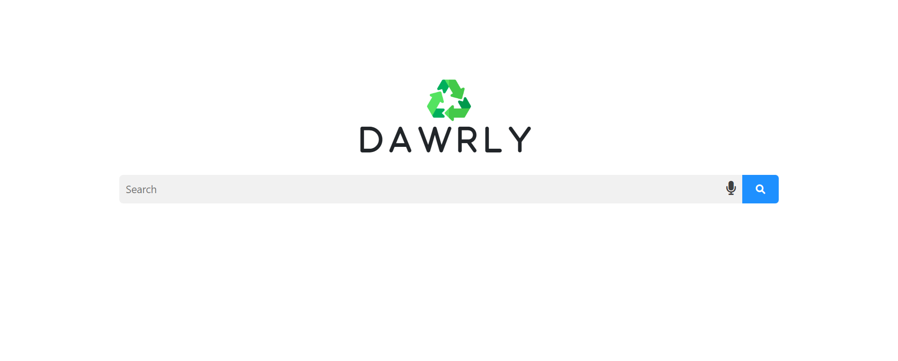
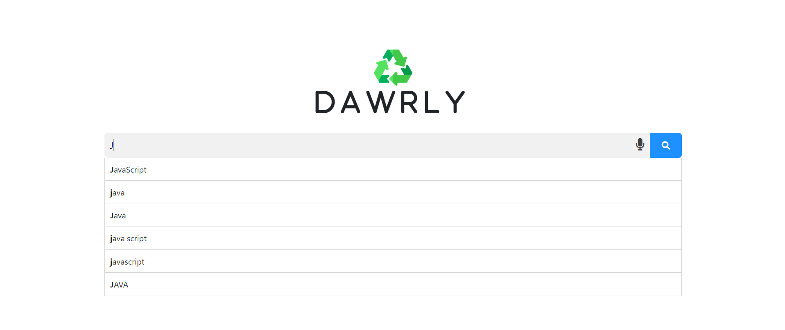
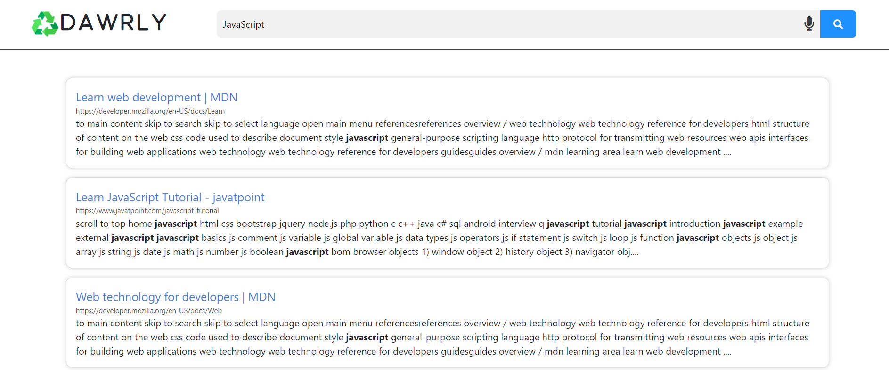
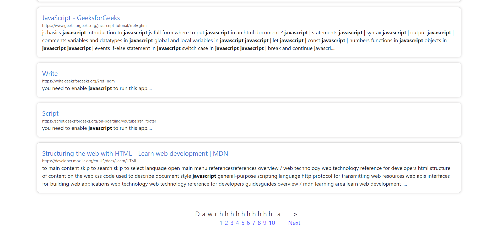
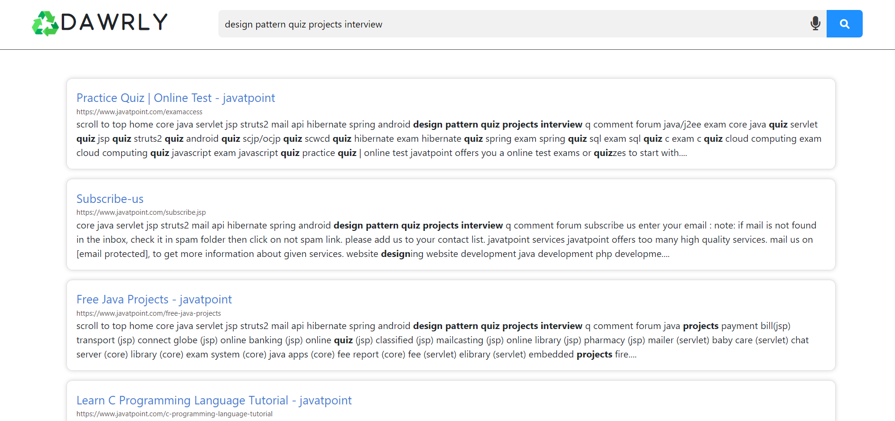

<div align="center">
<a href="https://github.com/ZeyadTarekk/Dawrly" rel="noopener">

</a>

</div>

<div align="center">

[](https://github.com/Abd-ELrahmanHamza/Dawrly/contributors)
[](https://github.com/Abd-ELrahmanHamza/Dawrly/issues)
[](https://github.com/Abd-ELrahmanHamza/Dawrly/blob/master/LICENSE)
[](https://github.com/Abd-ELrahmanHamza/Dawrly/network)
[](https://github.com/Abd-ELrahmanHamza/Dawrly/stargazers)
[](https://img.shields.io/github/languages/count/Abd-ELrahmanHamza/Dawrly)

</div>

## 📝 Table of Contents

- [About](#about)
- [Documentation](#doc)
- [Get started](#get-started)
  - [Prerequisite](#req)
  - [Installation](#Install)
  - [Running](#running)
- [Technology](#tech)
- [Screenshots](#Screenshots)
- [Contributors](#Contributors)
- [License](#license)

## 📙 About <a name = "about"></a>

- Crawler based search engine that demonstrates the main features of a search engine (web crawling, indexing and ranking) and the interaction between them.

## 📃 Documentation <a name = "doc"></a>

- index.html file in documentation folder

## 🏁 Getting Started <a name = "get-started"></a>

> This is an list of needed instructions to set up your project locally, to get a local copy up and running follow these
> instructuins.

### Prerequisite <a name = "req"></a>

1. Apache Tomcat 9
2. MongoDB
3. Any Java IDE (Intellij in our case)

### Installation <a name = "Install"></a>

1. **_Clone the repository_**

```sh
$ git clone https://github.com/Abd-ELrahmanHamza/Dawrly.git
```

2. **_Right click on the folder and open it with the IDE_**

### Running <a name = "running"></a>

**_Running program_**

```sh
Run Crawler_Indexer_Main to start the Crawler then the Indexer
```
```sh
unzip "apache-tomcat-9.0.62.zip"
```

```sh
Copy the content of Interface file to "apache-tomcat-9.0.62\webapps\SearchEngine"
```

```sh
Copy "stopwords.txt" and "bodyFiles" to "apache-tomcat-9.0.62\bin"
```

```sh
Run main function in RunGUI class
```

## 💻 Built Using <a name = "tech"></a>

- **Java**

## 📷 Demo Screenshots <a name = "Screenshots"></a>

<div align="center">
<h3 align='left'>Main Screen</h3>
   
<h3 align='left'>Suggestion Mechanism</h3>
   </a>

<h3 align='left'>Results</h3>
</a>
<h3 align='left'>Pagination of results</h3>
</a>
<h3 align='left'>Phrase Searching</h3>
</a>

</div>

## Contributors <a name = "Contributors"></a>

<table>
  <tr>
    <td align="center">
    <a href="https://github.com/ZeyadTarekk" target="_black">
    
    <br />
    <sub><b>Zeyad Tarek</b></sub></a>
    </td>
    <td align="center">
    <a href="https://github.com/Abd-ELrahmanHamza" target="_black">
    
    <br />
    <sub><b>Abdelrahman Mohamed</b></sub></a>
    </td>
    <td align="center">
    <a href="https://github.com/BeshoyMorad" target="_black">
    
    <br />
    <sub><b>Beshoy Morad</b></sub></a>
    </td>
    <td align="center">
    <a href="https://github.com/ZiadSheriif" target="_black">
    
    <br />
    <sub><b>Ziad Sherif</b></sub></a>
    </td>
    
    
  </tr>
 </table>

## License <a name = "license"></a>

> This software is licensed under MIT License, See [License](https://github.com/Abd-ELrahmanHamza/Dawrly/blob/main/LICENSE) for more information ©Abd-ELrahmanHamza.
